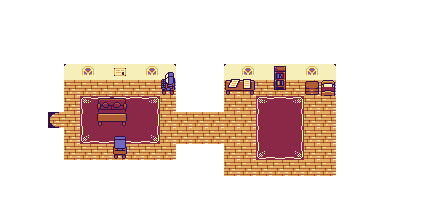
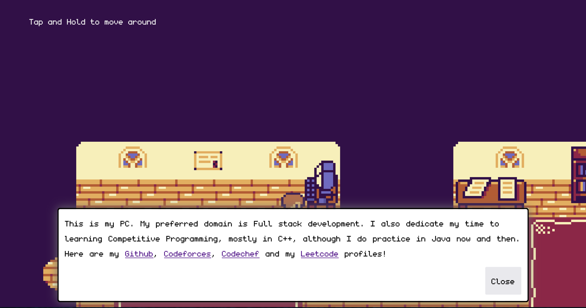

# 2D-portfolio

A **2D portfolio** project built with [Vue.js](https://vuejs.org/) and [Kaboom.js](https://kaboomjs.com/). This project showcases my skills, experiences, and projects in a fun and interactive way using 2D game-like visuals. The portfolio is fully interactive, allowing users to navigate between sections like a 2D game.

## Features
- **Interactive UI** using Kaboom.js for game-like navigation.
- Built with **Vue.js** for component-based development.
- Simple and engaging animations.
- Display of projects, experiences, and skills.
- Optimized for performance and responsive design.

---

## 🖼️ Screenshots

### Home Screen


<!-- ### Projects Section
 -->

### Skills Section


---

<!-- ## 🚀 Demo

Check out the live version of the portfolio here: [Live Demo](insert-demo-link-here) -->

---

## 💻 Tech Stack

- **Vue.js** - JavaScript framework for building UI components.
- **Kaboom.js** - Library for building interactive 2D games.
- **HTML5/CSS3** - For structuring and styling the project.
- **JavaScript (ES6+)** - For logic and interactivity.
- **Node.js** - For backend API (if applicable).

---

## 🔧 Installation

Follow these steps to run the project locally:

1. **Clone the repo**:
   ```bash
   git clone https://github.com/your-username/your-repo-name.git
   ```

2. **Run the project**:
   ```bash
   npm run dev
   ```